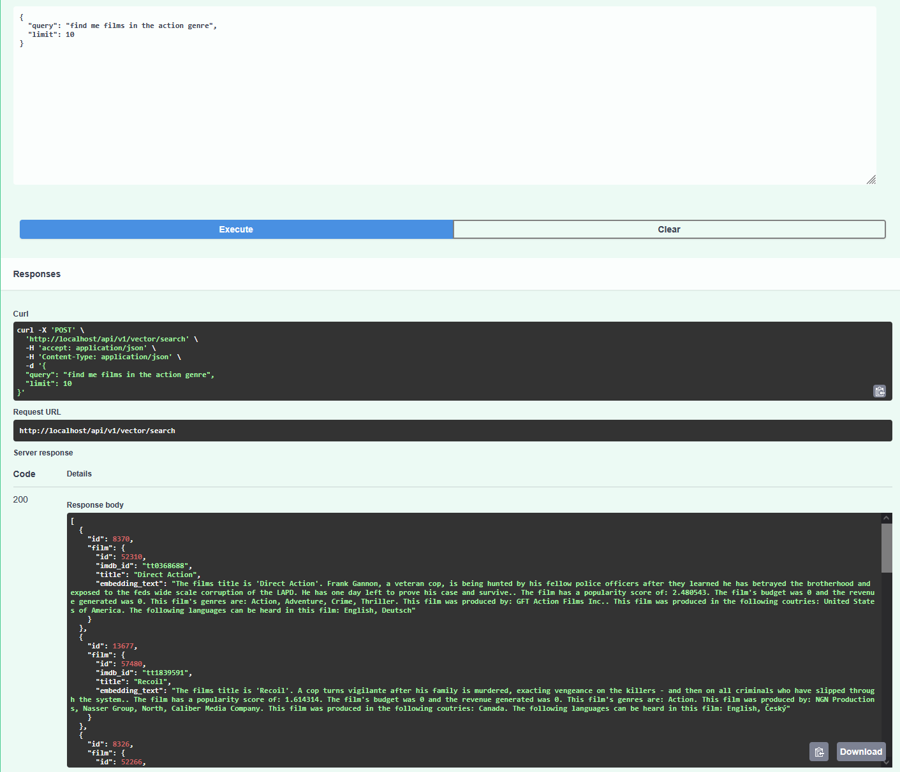

# mcp-example
Example repo for showing the structure of how MCP should work

## References:
Dataset was pulled from here: https://www.kaggle.com/datasets/rounakbanik/the-movies-dataset

## Commands:
`docker-compose exec example-api-app python app/cli.py` - lets you run the example API CLI.
`docker-compose exec example-api-app alembic upgrade head` - runs any new database migrations.

# Setup:
This repo is orchestrated using docker compose. To start you will need to create a `.env` file that copies the values from the example, fill in any of the missing details, any missing values will have a short line telling you what to do, anything that requires a specific command to be run will say so.

You will need to add the following to your `~/.zshrc` to get this working with the correct user for migration file permissions:
```sh
export DOCKER_CURRENT_USER="$(id -u):$(id -g)"
```

In order to start the service you need to run `docker-compose watch` this should pull the relevant images and start the services. There is a migration container that should run the db migrations so you can connect using your favorite db viewer and see how the data will be structured.

If you want to view the data jupyter labs has also been installed, you can run it by going into the `example-api` directory and running `uv run jupyter lab`. There is already a default notebook for viewing the data that's been imported.

Afterwards you'll need to run the following commands to download and index the data as well as create the embedding vectors:

- `docker-compose exec example-api-app python app/cli.py import-films --reset` => This will download the dataset from the link at the top of this file, unpack it, clean the data and load it into the db.
- `docker-compose exec example-api-app python app/cli.py create-embeddings --reset` => This will create the embeddings for the films based on an embedding text blob which you can see defined in the Film model. This will take a _long_ time, my current machine has it running for 30~ minutes, whilst it's running you can start to search from the Open API frontend.

After those two commands are finished or whilst the second one is running you can go to the vector API (localhost:90/docs) and use the `/api/v1/vector/search` endpoint to do vector search on the provided text. Results should show the associated model with the vector along with the embedding text used for creating the embedding.

